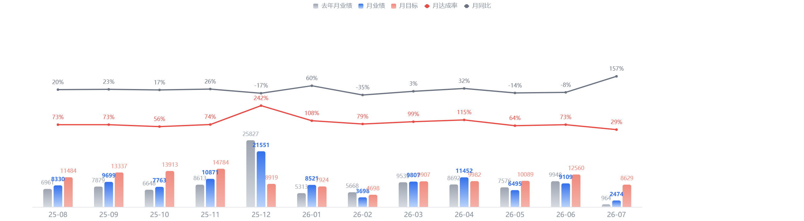
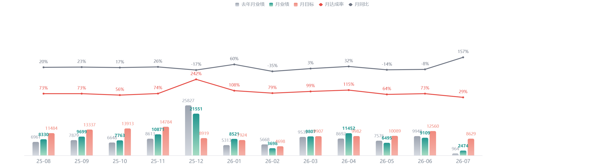
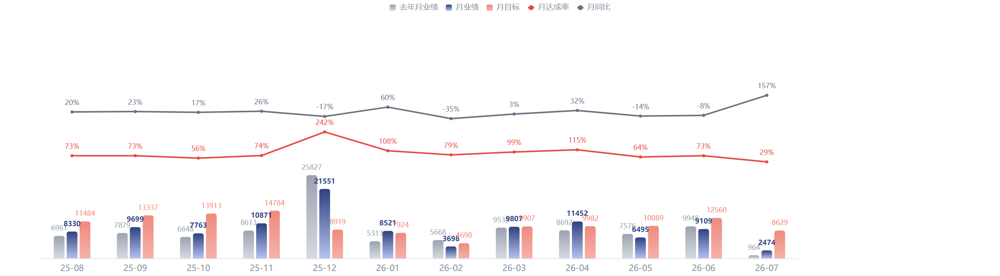
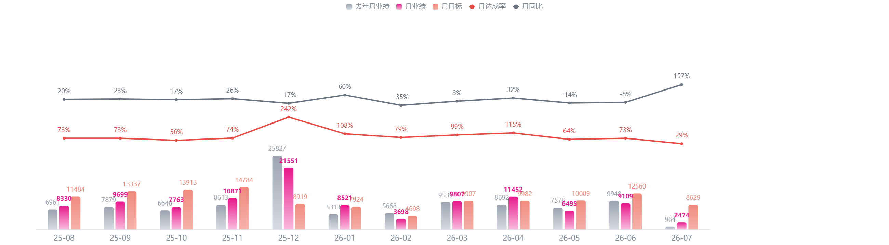

# BI Dashboard Design Skill

<p>
  
  
  
  
</p>

> 把一套从 16 张生产环境 BI 看板中沉淀出来的个人视觉设计语言（Visual DNA），变成任何 AI Agent 都能持续复用的看板设计能力。

**一句话风格**：浅灰画布上的白卡片矩阵，居中字距标题，渐变柱形，数据标签常开，红线丈量目标差距，月蓝年橙，绿=向好红=向差，高密度但每卡只答一个问题。

---

## ✨ 它能做什么

装上这个 skill 后，对 Agent 说"做个 XX 看板"，它会：

| 模式 | 触发场景 | 产出 |
|---|---|---|
| **HTML 模式** | 要成品、原型、演示 | 单文件 HTML + ECharts 可交互看板，视觉 100% 按 DNA 渲染 |
| **规范模式** | 要在 Quick BI / FineBI 等工具里搭 | 逐卡片的设计规范文档（分区骨架、图表选型、精确色值、字号），照着配置即可 |

核心能力：四套预设主题 + 用户品牌色自定义推导（用户需求永远优先）、行型库排版逻辑（一行放几个查表即用）、目标管理四件套（目标/达成/差距/时间进度虚线）、图表溢出与错乱的双层质检——HTML 产物内置 `?qa=1` 几何自检,打开页面即自动标红溢出/参差/越界并出报告。

## 🎨 主题速览

| 主题 | 主色 | 色卡 | 适用业务域 |
|---|---|---|---|
| `blue` 商务蓝（默认） | `#3370EB` |  | 集团经营、业绩、销售、通用 |
| `teal` 医养青绿 | `#21968F` |  | 医院、健康、商城、活动、监测 |
| `navy` 藏蓝薰衣草 | `#2E4180` |  | 渠道/代理月报、沉稳汇报 |
| `pop` 洋红青黄 | `#E8188C` |  | 营销专项、大促、高注目临时看板 |

语义色跨主题恒定：   。用户有品牌色时按 `references/design-tokens.md` §2.5 推导整套自定义主题。

## 📦 仓库结构

```
bi-dashboard-design-skill/
├── bi-dashboard-design/            # skill 本体（安装这个目录）
│   ├── SKILL.md                    # 入口：工作流、主题选择、自检清单
│   ├── references/
│   │   ├── design-tokens.md        # 唯一色值/字体/间距事实来源 + 自定义主题推导法
│   │   ├── layouts.md              # 行型库、宽度算法、溢出质检（排版核心）
│   │   ├── components.md           # 页头/KPI/进度环/目标条/表格等组件词汇表
│   │   └── charts.md               # 图表语言 + ECharts 配置片段
│   ├── assets/
│   │   └── starter-template.html   # 四主题起步骨架（内置 ?qa=1 几何自检；勿从零手写）
│   ├── evals/evals.json            # 6 个测试用例（含 2 个对抗性溢出用例）
│   └── scripts/
│       ├── check.py                # 回归断言器（用例 0-3 静态断言；4-5 靠 ?qa=1）
│       └── check_sync.py           # tokens ↔ 模板 逐块逐值同源校验
├── docs/samples/                   # 签名图型四主题实机渲染样例
├── dist/
│   └── bi-dashboard-design.skill   # 一键安装包（zip，打包 bi-dashboard-design/）
├── LICENSE
└── README.md
```

## 🚀 安装

### Claude Code

```bash
git clone https://github.com/<your-username>/bi-dashboard-design-skill.git

# 个人技能（所有项目可用）
mkdir -p ~/.claude/skills
cp -r bi-dashboard-design-skill/bi-dashboard-design ~/.claude/skills/

# 或作为项目技能（随仓库与团队共享）
mkdir -p .claude/skills
cp -r bi-dashboard-design-skill/bi-dashboard-design .claude/skills/
```

重启会话后，提到"看板/仪表盘/驾驶舱/日报"等即自动触发。

### Claude 桌面版 / Claude.ai / Cowork

下载 [`dist/bi-dashboard-design.skill`](dist/bi-dashboard-design.skill)，在 **设置 → 功能（Capabilities）→ 技能** 中上传；或直接把 `.skill` 文件发给 Claude，点击卡片上的 **Save skill**。

### Claude Agent SDK

技能目录放入项目 `.claude/skills/`，配置中启用文件系统技能加载（`settingSources` / `setting_sources`）并在 `allowed_tools` 中包含 `"Skill"`。

### 其他任意 Agent（通用方案）

本 skill 是纯 Markdown + 单 HTML 资产，无私有依赖：把 `bi-dashboard-design/` 放进 Agent 可读的工作区，将 `SKILL.md` 顶部 frontmatter 的 `name` + `description` 注入系统提示作为触发条件，并指示 Agent 在执行时按 `SKILL.md` 的指引读取 `references/` 下的分册。

## 💬 使用示例

```text
帮我做一个「会员商城运营月报」HTML 看板，含核心KPI、月趋势对比目标、渠道构成、商品TOP10
```

```text
我要在 Quick BI 里搭「门诊运营驾驶舱」，给我一份能逐项照配的视觉设计规范
```

```text
我们品牌色是 #7C3AED，按品牌色做一个 SaaS 客户成功团队周报看板
```

## 📊 效果验证

同一批任务、同一模型，带 skill 与裸跑（无 skill）的程序化断言通过率：

| 配置 | 断言通过率 | 表现 |
|---|---|---|
| **带 skill** | **100%**（26/26） | 正确选主题/推导品牌主题、复现签名组件、排版按行型库、溢出防线齐备 |
| 不带 skill | 34% | 随机配色、暗黑大屏跑偏、无目标管理语义、无溢出防护 |

## 📸 签名图型样例

由 `assets/starter-template.html` 实机渲染的**目标达成组合图**(一张图讲完「去年—今年—目标—达成率—同比」)。三组渐变柱贴地,达成率红线与同比灰线各占一条独立空域悬浮于上——两条率线的纵向位置**按数据自身值域反推**(不用写死偏移),换任何量级的数据都稳定分层、不压柱。四主题各一张:

| 主题 | 渲染 |
|---|---|
| `blue` 商务蓝 |  |
| `teal` 医养青绿 |  |
| `navy` 藏蓝薰衣草 |  |
| `pop` 洋红青黄 |  |

> 想看完整看板:本地 `python -m http.server` 起个静态服务,浏览器打开 `starter-template.html`(加 `?qa=1` 可跑内置几何自检),顶部按钮切换四主题。

## 🔧 定制

- **改色/改字号**：只改 `references/design-tokens.md` §8（唯一事实来源），并把 `assets/starter-template.html` 的 `<style>` 同步到同值。
- **新增主题**：在 tokens §2 加一行主题定义、§8 加一行 CSS 变量，模板 `[data-theme]` 同步一行。
- **加组件/行型**：按现有条目格式追加到 `components.md` / `layouts.md`。
- **同源校验**：改完 token 后跑 `python bi-dashboard-design/scripts/check_sync.py`——校验 §8 与模板逐值一致、且表格引用的 token 都有定义（退出码非 0 即不一致）。
- **回归测试**：改完用 `evals/evals.json` 的 6 个用例复测（`python bi-dashboard-design/scripts/check.py <产物> <id>`；对抗溢出用例 4-5 用 `?qa=1` 几何自检验证）。

## 📜 License

[MIT](LICENSE) © 2026 Wyexin
